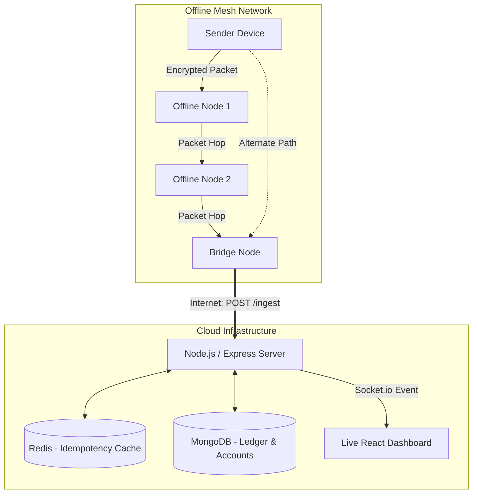

# 🌐 Offline UPI Mesh Payment System

[](https://nodejs.org/)
[](https://reactjs.org/)
[](https://www.mongodb.com/)
[](https://redis.io/)
[](https://opensource.org/licenses/MIT)

> A Proof-of-Concept Distributed System enabling secure, offline digital payments through device-to-device mesh networking. Built to solve the challenge of digital financial inclusion in low-connectivity regions.

---

## 💡 The Problem & The Solution

**The Problem:** Traditional digital payment systems (like UPI in India) rely entirely on real-time internet connectivity. In remote areas, during network outages, or in crowded spaces (concerts/stadiums), transactions fail, hindering true financial inclusion.

**The Solution:** This project simulates a decentralized architecture where transactions are processed offline. A sender encrypts a payment packet, broadcasts it over a local mesh network (simulating Bluetooth/Wi-Fi Direct), and the packet "hops" between offline devices until it reaches a "Bridge Node" (a device with internet access) which securely settles the transaction with the central bank/server.

---

## 🧠 Technical Complexity & Key Achievements

As a software engineer, building this required solving several complex distributed systems challenges:

- **End-to-End Security (Hybrid Cryptography):** Designed a security layer where intermediate offline nodes cannot read or tamper with transaction packets. Packets are encrypted by the sender and can only be decrypted by the backend server using public/private key pairs.
- **Distributed Idempotency (Preventing Double Spending):** In a mesh network, the same transaction packet might reach the server through multiple paths. Implemented a highly concurrent Idempotency layer using **Redis** to guarantee that transactions are processed *exactly once*.
- **State Synchronization & Real-time WebSockets:** Engineered a live, reactive dashboard using **React** and **Socket.io** to visualize the mesh network, track packet hops, and instantly update global ledgers across connected clients.
- **System Orchestration:** Containerized the infrastructure (MongoDB & Redis) using **Docker Compose** for seamless developer onboarding and isolated environments.

---

## 🏗️ System Architecture



---

## 🛠️ Tech Stack

- **Frontend:** React, Vite, Socket.io-client, Axios, TailwindCSS (via Lucide React)
- **Backend:** Node.js, Express, Socket.io, Node Crypto (Hybrid Encryption)
- **Databases:** MongoDB (Persistent Data), Redis (In-memory Idempotency)
- **DevOps / Infra:** Docker, Docker Compose
- **Testing:** Jest, MongoDB Memory Server

---

## 🧪 Quality Assurance & Testing

This project emphasizes reliability and code quality:
- **Unit Testing:** Implemented automated test suites using **Jest**.
- **Security Testing:** Cryptography logic is heavily tested to ensure keys are generated correctly and payloads are completely unreadable to unauthorized entities.
- **Environment Simulation:** Uses `mongodb-memory-server` for rapid, isolated integration testing.

---

## ⚙️ How to Run Locally

### Prerequisites
- Node.js (v16+)
- Docker & Docker Compose
- Git

### 1. Spin up Infrastructure (Database & Redis)
```bash
docker-compose up -d
```

### 2. Start the Backend API
```bash
cd server
npm install
npm run dev
```
*(Runs on `http://localhost:3000`)*

### 3. Start the Frontend Dashboard
```bash
cd client
npm install
npm run dev
```
*(Runs on `http://localhost:5173`)*

---

## 🔮 Future Roadmap

If I were to scale this into a production-grade application, I would implement:
1. **Zero-Knowledge Proofs (ZKPs):** To allow offline nodes to verify the sender actually has the balance without revealing what the balance is.
2. **React Native Mobile App:** To replace the mesh simulator with actual Bluetooth Low Energy (BLE) / Wi-Fi Direct device-to-device communication.
3. **Kafka Event Streaming:** Replace the basic Socket.io events with Apache Kafka for high-throughput, fault-tolerant transaction processing pipelines.
4. **CI/CD Pipeline:** Add GitHub Actions for automated testing and Docker image deployment.

---
*Built to showcase skills in Full-Stack Development, Distributed Systems, and Cryptography.*
